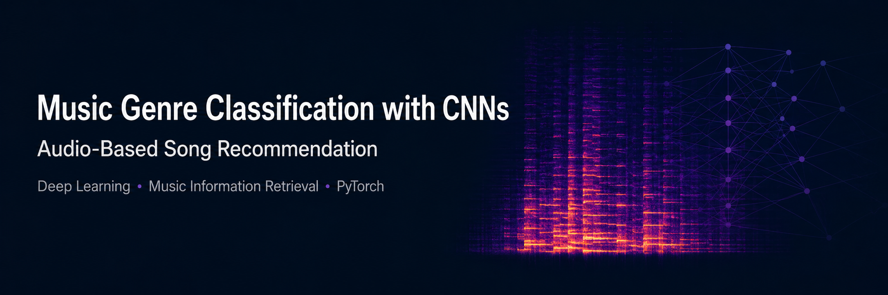
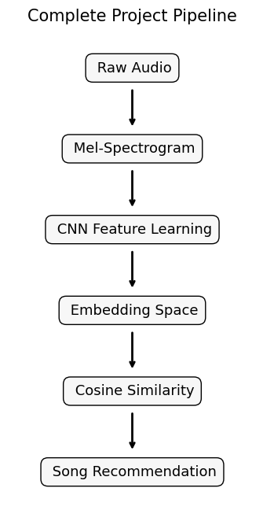
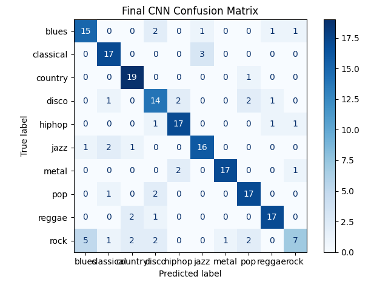
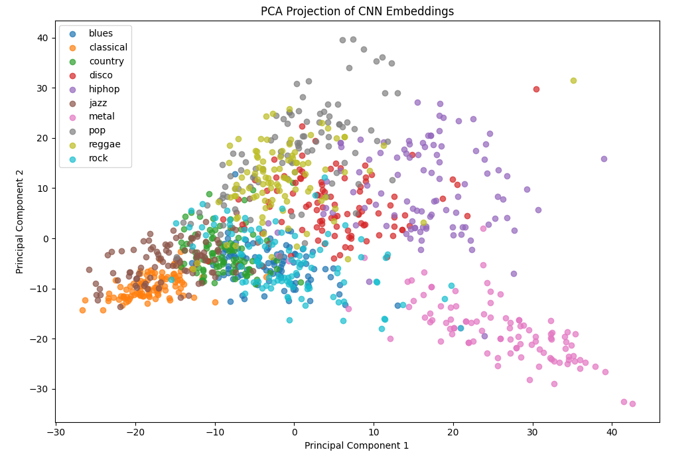
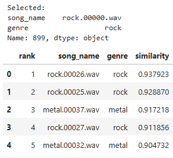

<p align="center">
  
</p>

# Music Genre Classification with CNNs and Audio-Based Song Recommendation

An end-to-end machine learning project exploring music genre classification, feature engineering, convolutional neural networks, and content-based music recommendation using the GTZAN dataset.


---

## 📖 Project Overview

Music genre classification is a classical problem in Music Information Retrieval (MIR). While traditional approaches rely on handcrafted audio descriptors such as MFCCs, modern deep learning models are capable of learning meaningful audio representations directly from spectrograms.

The goal of this project was to investigate both approaches and compare their strengths before extending the final CNN into a content-based music recommendation system.

The project follows a complete machine learning workflow:

- Audio preprocessing
- Feature engineering
- Classical machine learning
- Deep learning
- Model optimization
- Feature representation analysis
- Content-based music recommendation

---

## 🚀 Project Pipeline

```text
Raw Audio (.wav)
        │
        ▼
Mel-Spectrogram
        │
        ▼
CNN Feature Learning
        │
        ▼
Learned Embeddings
        │
        ▼
Cosine Similarity
        │
        ▼
Music Recommendation
```

<p align="center">

</p>

---

# 📂 Repository Structure

```
Music-Genre-Classification/
│
├── data/
│
├── notebooks/
│   ├── 01_audio_exploration.ipynb
│   ├── ...
│   ├── 12_final_cnn_classifier.ipynb
│   ├── 13_content_based_music_recommendation.ipynb
│   └── 14_final_project_review.ipynb
│
├── results/
│
├── models/
│
├── requirements.txt
│
└── README.md
```

---

# 📚 Notebook Overview

| Notebook | Topic |
|-----------|-------|
| 01 | Audio exploration and visualization |
| 02 | Mel-spectrogram generation |
| 03 | Dataset preparation |
| 04 | MFCC feature extraction |
| 05 | Random Forest baseline |
| 06 | First CNN classifier |
| 07 | Model comparison |
| 08 | MFCC-based recommendation |
| 09 | Feature representation analysis |
| 10 | CNN optimization |
| 11 | Feature Fusion Random Forest |
| 12 | Final CNN classifier |
| 13 | CNN-based recommendation |
| 14 | Final project review |

---

# 🧠 Machine Learning Workflow

During the project several machine learning approaches were investigated.

| Model | Features | Purpose |
|--------|----------|----------|
| Random Forest | MFCC | Classical baseline |
| CNN | Mel-Spectrogram | Automatic feature learning |
| Feature Fusion Random Forest | Multiple handcrafted features | Strongest classical classifier |
| Final CNN | Learned embeddings | Classification + Recommendation |

---

# 📊 Final Results

### 🎯 Final CNN

- Trained on the complete GTZAN dataset
- 10 music genres
- Data augmentation
- Early stopping
- Learning rate scheduling

<p align="center">

</p>

### Performance

| Metric | Result |
|---------|---------|
| Test Accuracy | **78%** |
| Classes | **10** |
| Input | Mel-Spectrogram |
| Recommendation | ✅ |

---

# ⭐ Key Findings

The project led to several important observations:

- Handcrafted audio features remain highly competitive for classical machine learning.
- Feature Fusion achieved the strongest classification accuracy on the reduced dataset.
- CNNs successfully learned meaningful audio representations directly from Mel-spectrograms.
- Data augmentation improved the CNN's generalization performance.
- Learned CNN embeddings could be reused for content-based music recommendation.
- Similar genres naturally formed neighboring regions within the learned embedding space.

---

# 🎵 Content-Based Recommendation

Instead of relying on manually engineered MFCC features, the final recommendation system uses the learned feature representations extracted from the trained CNN.

```
Song
   │
   ▼
CNN
   │
   ▼
Embedding
   │
   ▼
Cosine Similarity
   │
   ▼
Recommended Songs
```

Qualitative listening experiments showed musically meaningful recommendations, including:

- Rock → Rock / Metal
- Blues → Blues / Jazz
- Reggae → Reggae
- Classical → Classical

indicating that the learned embedding space captures perceptually meaningful musical similarities.

<p align="center">

</p>

---

# 🛠 Technologies

- Python
- PyTorch
- Librosa
- NumPy
- Pandas
- Scikit-Learn
- Matplotlib

---

# ▶ Installation

Clone the repository

```bash
git clone https://github.com/<your-repository>.git
```

Create a virtual environment

```bash
python -m venv .venv
```

Activate the environment

Linux / WSL

```bash
source .venv/bin/activate
```

Windows

```bash
.venv\Scripts\activate
```

Install dependencies

```bash
pip install -r requirements.txt
```

---

# 🔮 Future Work

Possible future extensions include:

- Larger music datasets
- Transformer-based audio models
- Contrastive learning
- Spotify API integration
- User preference modelling
- Interactive recommendation interface

---

# 🎓 Project Summary

This project demonstrates a complete end-to-end machine learning workflow for audio analysis.

Starting from raw audio recordings, different feature representations and machine learning models were investigated before developing a convolutional neural network capable of both music genre classification and content-based music recommendation.

The project highlights how learned audio representations can successfully bridge the gap between classification and recommendation, resulting in a unified deep learning pipeline for music analysis.

<p align="center">

</p>


---

## Project Highlights

✔ Complete end-to-end machine learning workflow

✔ Classical machine learning and deep learning comparison

✔ CNN trained on the complete GTZAN dataset

✔ Data augmentation and model optimization

✔ CNN embeddings reused for music recommendation

✔ Fully documented development process across 14 notebooks

## Acknowledgements

This project was developed as part of a machine learning course focusing on audio signal processing, deep learning, and music information retrieval.